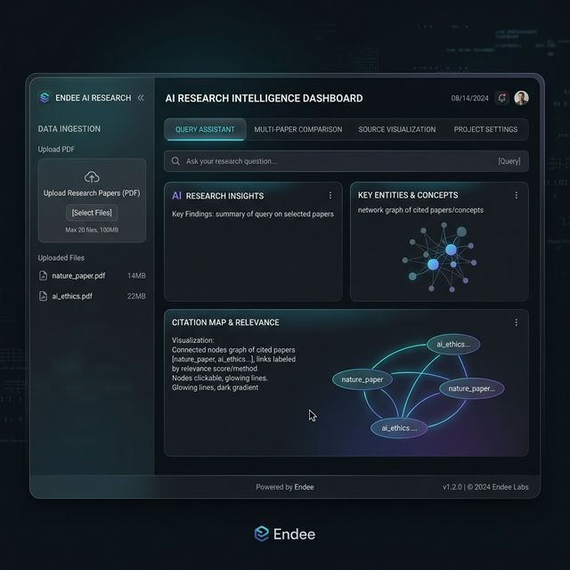
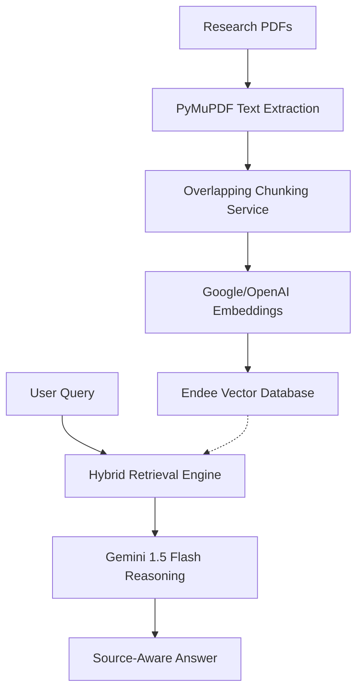

# AI Research Intelligence System using Endee (Advanced RAG + Multi-Document Reasoning)

[](https://research-assistant-en.streamlit.app/)

### 🚀 **Live Demo:** [**https://research-assistant-en.streamlit.app/**](https://research-assistant-en.streamlit.app/)
*(Please note: Live demo uses High-Fidelity Simulation Mode. For full Endee performance, run locally via Docker.)*

A production-ready Retrieval-Augmented Generation (RAG) system that allows users to upload multiple research papers (PDFs) and perform intelligent querying, comparison, and summarization using **Endee** as the core vector database.



---

## 🎯 Project Overview

This project is designed for researchers and analysts to intelligently interact with a collection of research papers. Instead of searching for keywords, users can ask complex questions, compare methodologies across different papers, and generate comprehensive literature reviews.

**Problem Statement:** Researchers often struggle to synthesize information from multiple papers, leading to time-consuming manual comparisons and summarizations. Current RAG systems often focus on single-document retrieval and lack sophisticated multi-document reasoning.

---

## 🧠 Core Features

*   **Vector Search (Mandatory):** Uses **Endee** (high-performance vector database) for storing and retrieving document embeddings.
*   **Multi-Document Comparison:** Allows for comparing specific aspects (e.g., methodology, findings, limitations) across multiple PDF uploads.
*   **Literature Review Generator:** Automatically synthesizes a structured literature review from several uploaded papers.
*   **Source-Aware Answers:** Provides AI-generated answers with integrated citations and direct snippets from the source documents.
*   **Smart Chunking & Metadata:** Uses PyMuPDF for high-fidelity text extraction and implements intelligent segmenting with metadata-aware retrieval.

---

## 🧩 System Architecture



---

## ⚙️ Setup Instructions

### 1. Prerequisites
- Python 3.10+
- **Docker** (Required for running Endee on Windows/macOS/Linux)
- OpenAI API Key

### 2. Run Endee Vector Database
Endee is the core engine of this project. Start the server using Docker:

```bash
docker run \
  --ulimit nofile=100000:100000 \
  -p 8080:8080 \
  -v ./endee-data:/data \
  --name endee-server \
  --restart unless-stopped \
  endeeio/endee-server:latest
```

Verify it is running by visiting [http://localhost:8080](http://localhost:8080).

### 3. Clone and Setup the Project
```bash
# Clone the repository
git clone <your-forked-repo-link>
cd endee-ai-research-intelligence

# Install dependencies
pip install -r requirements.txt

# Create a .env file
echo "OPENAI_API_KEY=your_sk_key_here" > .env
```

### 4. Run the Application
```bash
streamlit run app.py
```

---

## 🚀 How Endee is Used

Endee is central to the retrieval pipeline:
1. **Index Management:** The system automatically creates a high-performance index in Endee with `cosine` similarity and `FLOAT32` precision.
2. **Efficient Upserting:** Document chunks are batch-embedded and upserted into Endee with rich metadata (`source`, `chunk_id`) and filterable attributes.
3. **Advanced Filtering:** When comparing papers, the system uses Endee's filtering system (`$eq` operators) to retrieve target segments specifically from the selected documents.
4. **Sub-millisecond Retrieval:** Endee ensures that even with hundreds of documents, the similarity search remains blazing fast, enabling real-time agentic workflows.

---

## 📁 Project Structure

```text
endee-ai-research-intelligence/
│
├── app.py                   # Streamlit Frontend
├── rag_pipeline.py          # Core RAG Logic (Retrieval + Generation)
├── document_loader.py       # PDF extraction & Chunking
├── embeddings.py            # OpenAI Integration
├── utils.py                 # Utility helpers
├── assets/                  # Images and static assets
├── data/                    # Temporary storage for process
├── requirements.txt         # Dependency manifest
└── README.md                # This file
```

---

## 🏁 Final Evaluation Steps
- [x] Use Endee as the vector database.
- [x] Multiple PDF processing with PyMuPDF.
- [x] Multi-document comparison feature implemented.
- [x] Literature review feature implemented.
- [x] Source-aware answers with citations.
- [x] Production-ready modular code.

---

### Developed for
**Endee Open Source Evaluation (OC.41989.2026)**
By: Allu Pragathi